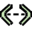

## Archimate Icon Catalog

> Use https://raw.githubusercontent.com/pauliev/public/main/archimate/{image}.png

| Name                | Image                  | Image@2x                    |
|---------------------|------------------------|----------------------------|
| Principle           |  |  |
| Capability          |  |  |
| Product             |  |  |
| Material            |  |  |
| Deliverable         |  |  |
| Meaning             |  |  |
| Requirement         |  |  |
| Plateau             |  |  |
| Resource            |  |  |
| Access              |  |  |
| Driver              |  |  |
| And-Junction        |  |  |
| Gap                 |  |  |
| Contract            |  |  |
| Business Service    |  |  |
| Or-Junction         |  |  |
| Stakeholder         |  |  |
| Business Object     |  |  |
| Technology Collaboration |  |  |
| Influence           |  |  |
| Business Event           |  |      |
| Technology Process       |  |  |
| Technology Service       |  |  |
| Value Stream             |  |          |
| Resource                 |  |                  |
| Composition              |  |            |
| Application Interface    |  |  |
| Business Process         |  |  |
| Assignment               |  |              |
| Application Collaboration|  |  |
| Technology Function      |  |  |
| Business Actor           |  |      |
| Value                    |  |                          |
| Business Object          |  |    |
| Course of Action         |  |  |
| Distribution Network     |  |  |
| Triggering               |  |              |
| Assessment               |  |              |
| Deliverable              |  |            |
| Workpackage              |  |            |
| Assessment                  |                |                  |
| Influence                   |                  |                    |
| Application Interaction     |  |  |
| Implementation Event        |  |  |
| System Software             |      |        |
| Technology Interaction      |  |  |
| Business Role               |          |            |
| Path                        |                            |                              |
| Application Interface       |  |  |
| Communication Network       |  |  |
| Outcome                     |                      |                        |
| Facility                    |                    |                      |
| Technology Event            |    |      |
| Representation              |        |          |
| Material                    |                    |                      |
| Contract                    |                    |                      |
| Implementation Event        |  |  |
| Serving                     |                      |                        |
| Grouping                    |                    |                      |
| Goal                        |                            |                              |
| Technology Interface        |  |  |
| Node                        |                            |                              |
| Business Process            |    |      |
| Course of Action            |    |      |
| Application Collaboration   |  |  |
| Communication Network       |  |  |
| Data Object                 |              |                |
| Actor                       |                          |                            |
| Location                    |                    |                      |
| Business Interaction        |  |  |
| Application Component       |  |  |
| Technology Interface        |  |  |
| System Software             |     |          |
| Technology Service          |  |    |
| Artifact                    |                   |                        |
| Aggregation                 |             |                  |
| Constraint                  |               |                    |
| Driver                      |                       |                            |
| Application Event           |  |      |
| Application Service         |  |  |
| Path                        |                           |                                |
| Realization                 |             |                  |
| Value Stream                |           |                |
| Value                       |                         |                              |
| Business Collaboration      |  |  |
| Application Function        |  |  |
| Gap                         |                             |                                  |
| Business Function           |  |      |
| And-Junction                |           |                |
| Association                 |             |                  |
| Application Event           |  |      |
| Business Interface          |  |  |
| Stakeholder                 |             |                  |
| Constraint                  |               |                    |
| Requirement                 |             |                  |
| Business Interaction        |  |  |
| Business Collaboration      |  |  |
| Serving                     |                     |                          |
| Grouping                    |                   |                        |

